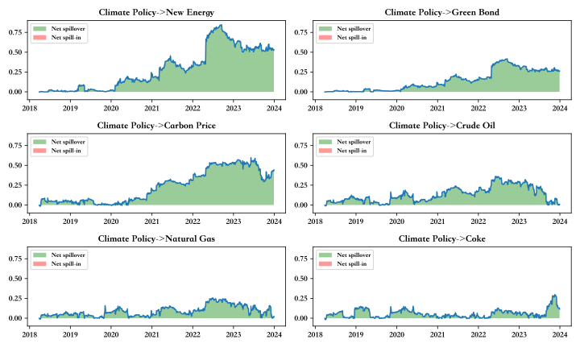

# Geopolitical Risk, Climate Risk in Energy of China
This repository contains the code and datasets for **"Spillover Effects of Volatility in Geopolitical Risks, Climate Policy Risks, Traditional Energy Markets, and Green Markets: Evidence from China"**.  The article are publishing.

All code and notebook xxxx.

To run the main code, xxxxx are required:

## Results

### Volatility of Indices

### Connectedness Networks

## Spillover Measurement

## Licenses
Database: CC-BY 4.0: https://creativecommons.org/licenses/by/4.0/. 
Code: MIT (https://choosealicense.com/licenses/mit/); year: 2021; copyright holders: xxx,xxx,xxx

## Contact
For any questions or comments, please write to: caoxianghan@gmail;;;